# Construcción del Ingreso con Datos Administrativos del SRI en Ecuador
## Informe Analítico: De los Formularios del SRI al Concepto de Ingreso DINA/WID

**Fecha: Febrero 2026**

---

## Resumen Ejecutivo

Este informe detalla cómo se construye el concepto de **ingreso** a partir de los datos administrativos del **Servicio de Rentas Internas (SRI)** de Ecuador, utilizando los formularios **F107 (RDEP)** y **F102 (Declaración de Renta de Personas Naturales)**. Se explica la estructura de los datos, cómo se agrupan en categorías de ingreso, y se plantea conceptualmente cómo operacionalizar esto en código para generar distribuciones de ingreso compatibles con el marco **DINA** (Distributional National Accounts) utilizado por WID.world.

---

## 1. Los Formularios del SRI: Estructura de Datos

### 1.1 Formulario 107 — RDEP (Anexo de Relación de Dependencia)

El **Anexo RDEP** (Retenciones en la Fuente bajo Relación de Dependencia) contiene la información que **cada empleador** reporta al SRI sobre los ingresos pagados a sus empleados. Es la principal fuente de **ingreso de trabajo asalariado** en los datos administrativos.

#### Variables Clave del F107

| Variable | Descripción | Rol en la Construcción de Ingreso |
|---|---|---|
| `CEDULA_PK_empleado` | Identificador anónimo del empleado | **Llave de unión** entre F107 y F102 |
| `RUC_PK_empleador` | Identificador del empleador | Permite identificar múltiples empleadores |
| `ingresos_liq_pagados` | Sueldos y salarios | **Componente principal** del ingreso laboral asalariado |
| `sob_suel_com_remu` | Sobresueldos, comisiones, bonos y otras remuneraciones gravadas | Complemento del ingreso laboral regular |
| `partic_utilidades` | Participación en utilidades | Ingreso variable ligado a beneficios empresariales |
| `decimo_tercero` | Décimo tercer sueldo | Beneficio social; necesita depuración (tope = sueldo mensual promedio) |
| `decimo_cuarto` | Décimo cuarto sueldo | Beneficio social; necesita depuración (tope legal basado en SBU) |
| `fondo_reserva` | Fondo de reserva | Aportación a la seguridad social (8,33% teórico); requiere corrección |
| `base_imponible` | Base imponible del impuesto a la renta | Ingreso gravado **neto** de deducciones y aportes IESS |
| `aporte_iess_empleado` | Aporte personal al IESS | Contribución a la seguridad social (no es ingreso disponible) |
| `valor_retenido` | Impuesto a la renta retenido | Permite estimar la carga tributaria efectiva |
| `imp_renta_causado` | Impuesto a la renta causado | Impuesto total correspondiente al ejercicio |
| `numero_meses_trab_empleador` | Meses trabajados con el empleador | Factor de annualización para empleos parciales |
| `ingresos_otros_empleadores` | Ingresos con otros empleadores | Permite detectar empleados con múltiples fuentes |

#### Depuraciones Necesarias en F107

> [!IMPORTANT]
> **El F107 reporta por la relación empleado-empleador**, no por persona. Una misma persona puede tener múltiples registros si trabaja con varios empleadores. Se debe colapsar por `CEDULA_PK_empleado` para obtener el ingreso total por persona.

**a) Tope del Décimo Cuarto:**
```
tope_d14 = (SBU / 12) × 9 + SBU = SBU × 1.75
decimo_cuarto_dep = min(decimo_cuarto, tope_d14)
```

**b) Tope del Décimo Tercero:**
```
decimo_tercero_dep = min(decimo_tercero, (ingresos_liq_pagados + sob_suel_com_remu) / 12)
```

**c) Corrección del Fondo de Reserva:**
```
fondo_reserva_teo = (ingresos_liq_pagados + sob_suel_com_remu + partic_utilidades) × 0.0833
freserva_correc = fondo_reserva    // por defecto
freserva_correc = fondo_reserva_teo   // si coef_fres > 0.0833 (se reemplaza el reportado por el teórico)
```

**Fórmula del Ingreso de Trabajo Asalariado (F107):**
```
ingreso_trabajo = base_imponible + decimo_tercero_dep + decimo_cuarto_dep + freserva_correc
```

> [!NOTE]
> **¿Por qué `base_imponible` y no `ingresos_liq_pagados`?** La `base_imponible` ya incluye sobresueldos, utilidades, y resta aportes al IESS. Es un punto de partida **post-IESS** pero **pre-IR (impuesto a la renta)**. Los décimos y fondo de reserva se suman porque son componentes no gravados que no están en la base_imponible pero sí son ingreso del trabajador.

---

### 1.2 Formulario 102 — Declaración de Renta de Personas Naturales

El **F102** es la declaración anual de impuesto a la renta que presentan las **personas naturales** y las **sociedades** (cuando se trata de personas naturales obligadas a llevar contabilidad). Captura ingresos de **actividad empresarial, trabajo autónomo y capital**.

#### Variables de Ingreso del F102

##### A. Ingreso de Trabajo — Actividad Empresarial (Obligados a llevar contabilidad)

| Variable | Casillero | Descripción |
|---|---|---|
| `total_ingresos_1440` | 1440 | **Total de ingresos** de la actividad empresarial (ventas, servicios, rendimientos financieros, dividendos, otras rentas) |

> [!WARNING]
> El casillero 1440 es un **total bruto** que incluye ingresos operacionales y no operacionales del negocio. Es la línea de "Total Ingresos" del estado de resultados. Para personas obligadas a llevar contabilidad, esto incluye ingresos del negocio pero también dividendos y rendimientos financieros percibidos por la persona. **No es directamente comparable con el ingreso laboral del F107** — es un ingreso bruto empresarial que incluye costos y gastos dentro de la declaración.

##### B. Ingreso de Trabajo — Autónomo / No Obligado

| Variable | Casillero | Descripción |
|---|---|---|
| `ing_libre_eje_profesional_2990` | 2990 | Ingresos de **libre ejercicio profesional** (médicos, abogados, ingenieros, etc.) |
| `ing_ocupacion_liberal_3010` | 3010 | Ingresos de **ocupación liberal** (incluye exclusivamente comisionistas, artesanos, agentes, etc.) |
| `ingresos_aem_rie_1280` | 1280 | Ingresos de **actividades empresariales** con registro simplificado |

##### C. Ingresos de Capital

| Variable | Casillero | Descripción |
|---|---|---|
| `ing_arriendo_inmuebles_3040` | 3040 | Ingresos por **arrendamiento de inmuebles** |
| `ing_arriendo_otros_act_3080` | 3080 | Ingresos por **arrendamiento de otros activos** (maquinaria, vehículos, etc.) |
| `rim_pgr_ant_anio_2008_3160` | 3160 | Ingresos de **predios agrícolas** |
| `ingresos_regalias_3170` | 3170 | Ingresos por **regalías** (propiedad intelectual, patentes, marcas) |
| `rendimientos_financieros_3190` | 3190 | **Rendimientos financieros** (intereses de depósitos, bonos, certificados) |
| `dividend_recib_soc_resid_5120` | 5120 | **Dividendos** recibidos de sociedades **residentes** en Ecuador |
| `div_recib_soc_no_resid_5130` | 5130 | **Dividendos** recibidos de sociedades **no residentes** |
| `ingr_enaj_drc_no_iru_5110` | 5110 | Ingresos por **enajenación de derechos representativos de capital** (ganancias de capital) |
| `ingresos_otr_rgr_3193` | 3193 | **Otras rentas gravadas** locales no registradas en Estado de Resultados |
| `otr_ing_gravados_exterior_3180` | 3180 | **Otros ingresos gravados del exterior** |

##### D. Variables de Impuesto (para análisis de carga tributaria efectiva)

| Variable | Casillero | Descripción |
|---|---|---|
| `base_imponible_3480` | 3480 | Base imponible total para el impuesto a la renta |
| `imp_renta_causado_3490` | 3490 | Impuesto a la renta causado |
| `total_retenciones_3540` | 3540 | Total de retenciones en la fuente |
| `total_impuesto_pagar_3570` | 3570 | Impuesto a la renta a pagar (neto de retenciones y créditos) |
| `utilidad_neta_ejercicio_2800` | 2800 | Utilidad neta del ejercicio |
| `utilidad_gravable_2970` | 2970 | Utilidad gravable |

##### E. Variables Exentas y Otras (para ingreso total comprehensivo)

| Variable | Casillero | Descripción |
|---|---|---|
| `ing_pensiones_jubilares_3450` | 3450 | Ingresos de **pensiones jubilares** |
| `ren_financieros_exe_3452` | 3452 | **Rendimientos financieros exentos** |
| `dec_ter_cua_sal_dig_3454` | 3454 | Décimo tercero, décimo cuarto y compensación salarial digna |
| `bon_des_desp_intemp_3456` | 3456 | Bonificación por desahucio e indemnizaciones |
| `otr_ingresos_exentos_3460` | 3460 | **Otros ingresos exentos** |
| `sub_otr_rentas_exentas_3470` | 3470 | Subtotal de otras rentas exentas |
| `ing_lot_rifas_apuestas_3400` | 3400 | Ingresos por loterías, rifas y apuestas |
| `img_herencias_leg_don_3420` | 3420 | Ingresos por herencias, legados y donaciones |

---

## 2. Construcción del Ingreso: Agregación de Componentes

### 2.1 La Lógica Actual (Código Existente)

El pipeline actual (`01_limpieza_merge.do` → `02_variables_ingreso.do`) construye tres agregados:

```
INGRESOS_TRAB_TOTAL    = ingreso_trabajo (F107)
                       + ING_TRAB_OBLIGADOS (F102: 1440)
                       + ING_TRAB_NO_OBLIGADOS (F102: 2990 + 3010 + 1280)

INGRESOS_CAPITAL_TOTAL = INGRESOS_CAPITAL (F102: 3040 + 3080 + 3160
                       + 3170 + 3190 + 5120 + 5130 + 5110 + 3193 + 3180)

INGRESOS_TOTAL         = INGRESOS_TRAB_TOTAL + INGRESOS_CAPITAL_TOTAL
```

### 2.2 Taxonomía Propuesta según el Marco DINA/WID

Para construir un ingreso compatible con el marco DINA, los componentes SRI se mapean a las categorías WID de la siguiente forma:

```mermaid
graph TB
    subgraph "F107 — RDEP"
        A[ingresos_liq_pagados<br>+ sob_suel_com_remu<br>+ partic_utilidades<br>+ décimos + fondo reserva]
    end

    subgraph "F102 — Trabajo Autónomo/Empresarial"
        B1[total_ingresos_1440<br>Obligados contabilidad]
        B2[ing_libre_eje_profesional_2990<br>Libre ejercicio]
        B3[ing_ocupacion_liberal_3010<br>Ocupación liberal]
        B4[ingresos_aem_rie_1280<br>Activ. empresarial simplif.]
    end

    subgraph "F102 — Capital"
        C1[ing_arriendo_inmuebles_3040<br>Arriendos inmuebles]
        C2[ing_arriendo_otros_act_3080<br>Arriendos otros activos]
        C3[rendimientos_financieros_3190<br>Rendimientos financieros]
        C4[dividend_recib_soc_resid_5120<br>Dividendos residentes]
        C5[div_recib_soc_no_resid_5130<br>Dividendos no residentes]
        C6[ingresos_regalias_3170<br>Regalías]
        C7[ingr_enaj_drc_no_iru_5110<br>Ganancias de capital]
        C8[rim_pgr_ant_anio_2008_3160<br>Predios agrícolas]
        C9[ingresos_otr_rgr_3193<br>Otras rentas gravadas]
        C10[otr_ing_gravados_exterior_3180<br>Ingresos gravados exterior]
    end

    A --> WAG["wag (Ingreso laboral<br>asalariado)"]
    B1 --> MIX["mix (Ingreso mixto /<br>empresarial)"]
    B2 --> MIX
    B3 --> MIX
    B4 --> MIX
    C1 --> CAP["cap (Ingreso de capital)"]
    C2 --> CAP
    C3 --> CAP
    C4 --> CAP
    C5 --> CAP
    C6 --> CAP
    C7 --> CAP
    C8 --> MIX
    C9 --> CAP
    C10 --> CAP

    WAG --> FISCAL["Ingreso Fiscal Total<br>(pre-tax)"]
    MIX --> FISCAL
    CAP --> FISCAL
```



#### Mapeo detallado SRI → DINA

| Categoría DINA | Código WID | Variables SRI | Notas |
|---|---|---|---|
| **Ingreso laboral (wages)** | `wag` | F107: `base_imponible` + `decimo_tercero_dep` + `decimo_cuarto_dep` + `freserva_correc` | Ingreso de trabajo asalariado, ya neto de IESS |
| **Ingreso mixto (mixed income)** | `mix` | F102: `ing_libre_eje_profesional_2990` + `ing_ocupacion_liberal_3010` + `ingresos_aem_rie_1280` + `rim_pgr_ant_anio_2008_3160` | Ingreso de trabajo independiente y agrícola. El casillero 1440 (`total_ingresos_1440`) se clasifica aquí cuando el declarante es empresario individual |
| **Ingreso de capital** | `cap` | F102: `ing_arriendo_inmuebles_3040` + `ing_arriendo_otros_act_3080` + `rendimientos_financieros_3190` + `dividend_recib_soc_resid_5120` + `div_recib_soc_no_resid_5130` + `ingr_enaj_drc_no_iru_5110` + `ingresos_regalias_3170` + `ingresos_otr_rgr_3193` + `otr_ing_gravados_exterior_3180` | Todo ingreso de propiedad (renta, intereses, dividendos, regalías, ganancias de capital) |
| **Pensiones** | `pen` | F102: `ing_pensiones_jubilares_3450` | Solo si se incluyen ingresos exentos |

---

## 3. Tratamiento del Casillero 1440 (total_ingresos)

> [!CAUTION]
> **El casillero 1440 (`total_ingresos_1440`) es el campo más delicado** de la construcción de ingreso. Es el "Total Ingresos" para personas obligadas a llevar contabilidad en el marco del Estado de Resultados del F102. Este total incluye:
>
> - Ingresos operacionales (ventas de bienes y servicios)
> - Ingresos no operacionales (dividendos, regalías, rendimientos financieros)
> - Ganancias por venta de activos
>
> **Problema**: Si se suma directamente al `ING_TRAB_NO_OBLIGADOS` y a `INGRESOS_CAPITAL`, se produce un **doble conteo** en los componentes de capital que ya están declarados en los casilleros 5120, 5130, 3190, 3170, etc.

### Solución propuesta:

```
ING_EMPRESARIAL_NETO = total_ingresos_1440
                     - dividendos_percibidos_dentro_ER  (si están incluidos en 1440)
                     - rendimientos_financieros_ER      (si están incluidos en 1440)
```

O alternativamente, **NO sumar 1440 con los casilleros de capital** sino usar la **utilidad neta** (`utilidad_neta_ejercicio_2800`) como proxy del ingreso empresarial.

---

## 4. Operacionalización en Código: Concepto a Implementación

### 4.1 Pipeline Completo Propuesto


### 4.2 Paso 1: Limpieza del F107 (RDEP)

```stata
* =====================================================================
* PASO 1: Ingreso de trabajo asalariado (F107)
* =====================================================================

use CEDULA_PK_empleado ingresos_liq_pagados sob_suel_com_remu  ///
    partic_utilidades decimo_tercero decimo_cuarto              ///
    fondo_reserva base_imponible aporte_iess_empleado           ///
    valor_retenido imp_renta_causado                            ///
    using "F107_${year}.dta", clear

* --- Depurar décimos y fondo de reserva ---
local sbu = ${sbu_${year}}
local tope_d14 = (`sbu' / 12) * 9 + `sbu'

gen d13_dep = min(decimo_tercero, ///
    (ingresos_liq_pagados + sob_suel_com_remu) / 12)

gen d14_dep = min(decimo_cuarto, `tope_d14')

* Fondo de reserva correcto (teórico = 8.33% de base)
egen fres_base = rowtotal(ingresos_liq_pagados  ///
    sob_suel_com_remu partic_utilidades)
gen fres_teo = fres_base * 0.0833
gen coef_fres = fondo_reserva / fres_base
gen fres_dep = fondo_reserva
replace fres_dep = fres_teo ///
    if (fres_dep > 0 & fres_dep < .) ///
     & (coef_fres > 0.0833 & coef_fres != .)

* --- INGRESO LABORAL BRUTO (pre-IR, post-IESS) ---
gen ING_LAB_BRUTO_F107 = base_imponible + d13_dep + d14_dep + fres_dep

* --- IMPUESTO Y CONTRIBUCIONES ---
gen IESS_EMPLEADO  = aporte_iess_empleado
gen IR_RETENIDO    = valor_retenido

* Colapsar por persona (múltiples empleadores)
collapse (sum) ING_LAB_BRUTO_F107 IESS_EMPLEADO IR_RETENIDO, ///
    by(CEDULA_PK_empleado)
rename CEDULA_PK_empleado CEDULA_PK
```

### 4.3 Paso 2: Limpieza del F102 (Renta PN)

```stata
* =====================================================================
* PASO 2: Ingresos de trabajo autónomo y capital (F102)
* =====================================================================

use CEDULA_PK                                          ///
    total_ingresos_1440                                ///
    ing_libre_eje_profesional_2990                     ///
    ing_ocupacion_liberal_3010                         ///
    ingresos_aem_rie_1280                              ///
    ing_arriendo_inmuebles_3040                        ///
    ing_arriendo_otros_act_3080                        ///
    rim_pgr_ant_anio_2008_3160                         ///
    ingresos_regalias_3170                             ///
    rendimientos_financieros_3190                      ///
    dividend_recib_soc_resid_5120                      ///
    div_recib_soc_no_resid_5130                        ///
    ingr_enaj_drc_no_iru_5110                          ///
    ingresos_otr_rgr_3193                              ///
    otr_ing_gravados_exterior_3180                     ///
    utilidad_neta_ejercicio_2800                        ///
    base_imponible_3480                                ///
    imp_renta_causado_3490                             ///
    using "F102_${year}.dta", clear

* --- INGRESO DE TRABAJO AUTÓNOMO (mix) ---
egen ING_AUTONOMO = rowtotal(                          ///
    ing_libre_eje_profesional_2990                     ///
    ing_ocupacion_liberal_3010                         ///
    ingresos_aem_rie_1280)

* --- INGRESO EMPRESARIAL (para obligados a llevar contabilidad) ---
*     Usar total_ingresos_1440 solo cuando no hay overlap con autónomo
gen ING_EMPRESARIAL = total_ingresos_1440
replace ING_EMPRESARIAL = 0 if ING_AUTONOMO > 0 & ING_EMPRESARIAL < .
*     Alternativa: usar utilidad_neta como proxy del ingreso empresarial

* --- INGRESOS DE CAPITAL ---
egen ING_CAPITAL = rowtotal(                           ///
    ing_arriendo_inmuebles_3040                        ///
    ing_arriendo_otros_act_3080                        ///
    rendimientos_financieros_3190                      ///
    dividend_recib_soc_resid_5120                      ///
    div_recib_soc_no_resid_5130                        ///
    ingr_enaj_drc_no_iru_5110                          ///
    ingresos_regalias_3170                             ///
    ingresos_otr_rgr_3193                              ///
    otr_ing_gravados_exterior_3180)

* --- INGRESO MIXTO (agrícola → clasificado como mixto en DINA) ---
gen ING_AGRICOLA = rim_pgr_ant_anio_2008_3160

* --- IMPUESTO CAUSADO F102 ---
gen IR_CAUSADO_F102 = imp_renta_causado_3490

* Colapsar por persona (declaraciones sustitutivas)
collapse (sum) ING_AUTONOMO ING_EMPRESARIAL ING_CAPITAL ///
    ING_AGRICOLA IR_CAUSADO_F102, by(CEDULA_PK)
```

### 4.4 Paso 3: Merge y Clasificación DINA

```stata
* =====================================================================
* PASO 3: Merge F107 + F102 → Ingreso total por persona
* =====================================================================

use "paso1_F107.dta", clear
merge 1:1 CEDULA_PK using "paso2_F102.dta", nogen

* Reemplazar missing por cero
foreach v of varlist ING_* IR_* IESS_* {
    replace `v' = 0 if `v' == .
}

* --- Componentes DINA ---
* Salarios (wag): F107
gen dina_wag = ING_LAB_BRUTO_F107

* Ingreso mixto (mix): F102 autónomo + empresarial + agrícola
gen dina_mix = ING_AUTONOMO + ING_EMPRESARIAL + ING_AGRICOLA

* Ingreso de capital (cap): F102 capital
gen dina_cap = ING_CAPITAL

* --- Ingreso fiscal total (pre-tax) ---
gen INGRESO_FISCAL = dina_wag + dina_mix + dina_cap

* --- Ingreso neto de impuestos (post-tax) ---
gen IR_TOTAL = IR_RETENIDO + IR_CAUSADO_F102
gen INGRESO_NETO = INGRESO_FISCAL - IR_TOTAL

* --- Labels ---
label var dina_wag        "Ingreso laboral asalariado (pre-IR, post-IESS)"
label var dina_mix        "Ingreso mixto (autónomo + empresarial + agrícola)"
label var dina_cap        "Ingreso de capital (arriendos, dividendos, intereses, regalías)"
label var INGRESO_FISCAL  "Ingreso fiscal total (pre-tax)"
label var INGRESO_NETO    "Ingreso neto de impuesto a la renta"
```

### 4.5 Paso 4: Preparación para Pareto Interpolation (formato gpinter)

Para integrar estos datos con el marco DINA, se necesita producir **tabulaciones por fractiles** compatibles con el formato `gpinter`:

```stata
* =====================================================================
* PASO 4: Tabulación para gpinter (formato WID/DINA)
* =====================================================================

* Ordenar por ingreso fiscal (de menor a mayor)
sort INGRESO_FISCAL

* Calcular fractiles de la población adulta
gen N_total = _N
gen rank = _n / N_total

* Definir puntos de corte estándar gpinter
local pcuts "0.10 0.20 0.30 0.40 0.50 0.60 0.70 0.80 0.90 0.95 0.99 0.999"

* Calcular ingreso promedio
sum INGRESO_FISCAL, meanonly
local avg = r(mean)

* Preparar archivo de salida gpinter
postfile gpinter_out double(p average thr) str3(country) int(year) ///
    using "gpinter_ECU_${year}.dta", replace

foreach pct in `pcuts' {
    * Umbral (threshold) en el percentil p
    local obs_at_p = round(`pct' * _N)
    local thr = INGRESO_FISCAL[`obs_at_p']

    * Ingreso promedio por encima del percentil p
    sum INGRESO_FISCAL if rank >= `pct', meanonly
    local avg_above = r(mean)

    post gpinter_out (`pct') (`avg_above') (`thr') ("ECU") (${year})
}

postclose gpinter_out

* Exportar a Excel (formato gpinter estándar)
use "gpinter_ECU_${year}.dta", clear
export excel "gpinter_ECU_${year}.xlsx", firstrow(variables) replace
```

> [!NOTE]
> El formato gpinter requiere: `p` (fractil como proporción), `average` (ingreso promedio de quienes están en o por encima de `p`), `thr` (umbral de ingreso en `p`), `country`, `year`. Este es exactamente el formato de los archivos `gpinter_ECU_2008.xlsx` a `gpinter_ECU_2011.xlsx` encontrados en el directorio `dina-latam/input_data/admin_data/ECU/`.

### 4.6 Paso 5: Conversión de Adultos a Población Total

Un paso adicional requerido por el marco DINA es convertir los fractiles de **adultos declarantes** a **población total**:

```stata
* =====================================================================
* PASO 5: Ajuste adultos → población total
* (replicando BRA-COL-ECU_adults_to_totpop.do de dina-latam)
* =====================================================================

* Cargar % de adultos en la población (de datos censales/WID)
local pct_adults = ${pct_adults_ECU_${year}}  // ej: 63.5

* Ajustar frecuencias: las fracciones de declarantes se multiplican
* por la proporción adultos/población para obtener fractiles de toda
* la población
gen freq = p[_n + 1] - p
replace freq = freq[_n - 1] if missing(freq)
replace freq = freq * (`pct_adults' / 100)

* Recalcular el fractil sobre población total
gsort -p
gen ptot = 1 - sum(freq)
sort p
drop freq p
rename ptot p

* Ajustar el promedio: multiplicar por adultos/pob.total
replace average = average * (`pct_adults' / 100)
```

---

## 5. Tasas Impositivas Efectivas

Un producto secundario de la construcción de ingreso es la **tasa impositiva efectiva**, que es insumo directo para el paso de conversión pre-tax/post-tax en DINA:

```stata
* =====================================================================
* TASA IMPOSITIVA EFECTIVA POR PERCENTIL
* =====================================================================

* Calcular tasa efectiva individual
gen tasa_efectiva = IR_TOTAL / INGRESO_FISCAL
replace tasa_efectiva = 0 if INGRESO_FISCAL <= 0

* Calcular por percentiles (formato eff-tax-rate de dina-latam)
xtile p_merge = INGRESO_FISCAL, nq(127)  // 127 fractiles estándar

collapse (mean) eff_tax_rate_ipol = tasa_efectiva, by(p_merge)

* Exportar
save "ECU_effrates_${year}.dta", replace
```

Estos archivos se almacenan en `input_data/admin_data/ECU/eff-tax-rate/` dentro de `dina-latam` y son utilizados por el paso 04b (build-pretax-surveys.do) para **convertir los ingresos post-tax de la encuesta ENEMDU a pre-tax**.

---

## 6. Integración con el Pipeline DINA (dina-latam)

Las tabulaciones gpinter y las tasas efectivas producidas con datos SRI se integran al pipeline DINA en dos puntos:

### 6.1 Corrección de Top Incomes (Paso 03a: BFM)

```
Encuesta ENEMDU (cubre toda la distribución, pero subestima el top)
        +
Tabulaciones SRI/gpinter (cubre declarantes, es preciso en el top)
        ↓
    BFM Correction (bfmcorr)
        ↓
Distribución corregida: bottom/middle de encuesta + top de impuestos
```

### 6.2 Conversión Post-tax → Pre-tax (Paso 04b)

```
Encuesta post-tax (Ecuador reporta ingresos netos)
        ÷
(1 - tasa_efectiva_por_percentil)
        =
Ingresos pre-tax individuales
```

---

## 7. Limitaciones y Consideraciones

### 7.1 Cobertura Poblacional

| Fuente | Cobertura |
|---|---|
| F107 (RDEP) | Solo asalariados **formales** (con retención en la fuente). Excluye informalidad |
| F102 (Renta PN) | Solo contribuyentes que **declaran** impuesto a la renta. Excluye informales y exentos |
| **Combinado F107+F102** | Universo de contribuyentes activos del SRI. Representan ~30-40% de la población adulta |

> [!WARNING]
> Los datos SRI sub-representan la parte inferior de la distribución de ingresos. Los individuos con ingresos por debajo de la fracción básica no están obligados a declarar impuesto a la renta. Por eso DINA usa los datos SRI **solo para corregir la parte superior** (top 10%) de la distribución, mientras que la parte inferior proviene de la encuesta ENEMDU.

### 7.2 Concepto de Ingreso

- El ingreso del F107 es **post-IESS pero pre-IR** (la base imponible ya descuenta aportes personales)
- El ingreso del F102 son **ingresos brutos** antes de deducciones y gastos
- La `utilidad_neta_ejercicio_2800` del F102 es la alternativa **neta** de costos y gastos

### 7.3 Doble Conteo

- Un asalariado que también tiene actividad independiente aparece en **ambos formularios** (F107 y F102)
- El merge por `CEDULA_PK` resuelve esto correctamente: cada persona aparece una sola vez con la suma de ambas fuentes
- **Dentro del F102**, el `total_ingresos_1440` puede incluir rendimientos financieros y dividendos que también están en los casilleros específicos (5120, 5130, 3190). Se debe verificar si hay solapamiento

### 7.4 Variación Temporal de los Casilleros

La `Matriz de equivalencia_102` en Variables_IRPN.xlsx muestra que **los números de casillero cambian entre años**. Por ejemplo, el campo de dividendos de sociedades residentes puede mapear al casillero 5120 en un año pero a otro número en otro año. El código debe usar la matriz de equivalencia para las correspondencias intertemporales.

### 7.5 Ingreso vs. Renta Imponible

- El `INGRESO_FISCAL` construido arriba **NO es la base imponible** del SRI
- La base imponible descuenta gastos personales, costos, deducciones, y exoneraciones
- Para DINA, se necesita el **ingreso pre-tax** (antes de impuestos pero después de seguridad social), que es más cercano al ingreso fiscal que a la base imponible

---

## 8. Resumen: Variables SRI → Categorías DINA

| Categoría DINA | Fuente SRI | Variables Utilizadas | Tipo de Ingreso |
|---|---|---|---|
| **wag** (Salarios) | F107 | `base_imponible` + décimos depurados + fondo reserva | Pre-IR, Post-IESS |
| **mix** (Ingreso mixto) | F102 | `2990` + `3010` + `1280` + `3160` (+ `1440` para obligados) | Bruto |
| **cap** (Capital) | F102 | `3040` + `3080` + `3190` + `5120` + `5130` + `5110` + `3170` + `3193` + `3180` | Bruto |
| **pen** (Pensiones) | F102 | `3450` (exento) | N/A en F107 |
| **Impuesto** | F107 + F102 | `valor_retenido` + `imp_renta_causado_3490` | Para tasa efectiva |
| **Seg. Social** | F107 | `aporte_iess_empleado` | Para análisis de contribuciones |
